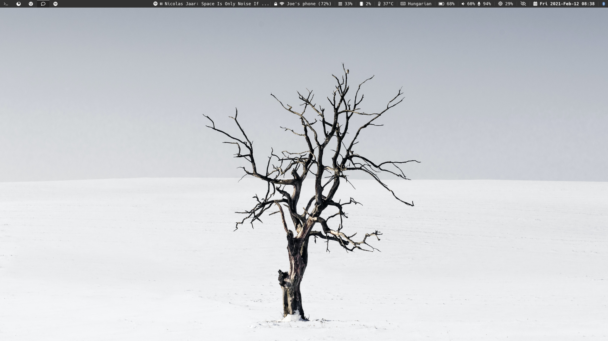

# [joelazar](https://github.com/joelazar)’s dotfiles

## Wallpaper



## Neovim with my [custom config](https://github.com/joelazar/nvim-config)


## Exa


## Lazygit


## Firefox + [Vimium](https://addons.mozilla.org/en-US/firefox/addon/vimium-c/)


## nnn + preview-tui


## ncspot


## neofetch + fzf


## Details

This is the dotfiles setup which I use for my [`Arch Linux`](https://archlinux.org/).
Theoretically, it could (and should) work on any non-unorthodox Arch based
distributions too, but I didn't test it.

Let me try to briefly list the installed and configured packages:

- [`yay`](https://github.com/Jguer/yay) - As an aur helper
- [`blackarch`](https://blackarch.org/) - repo added with some basic penetration tool set
- [`firejail`](https://firejail.wordpress.com/) - Running everything in sandbox
- [`docker`](https://www.docker.com/) - Container framework for OS level virtualization
- [`kitty`](https://sw.kovidgoyal.net/kitty/) - Fast, feature-rich, GPU based terminal emulator
- [`fish`](https://fishshell.com/) - Fish shell - [config](dot_config/private_fish)
  - [`fisher`](https://github.com/jorgebucaran/fisher) - A plugin manager for fish
    - [`fzf.fish`](https://github.com/PatrickF1/fzf.fish) - Fish + FZF
    - [`done`](https://github.com/franciscolourenco/done) - Automatically receive notifications when long processes finish
    - [`replay`](https://github.com/jorgebucaran/replay.fish) - Run Bash commands replaying changes in Fish
    - [./dot_config/private_fish/fish_plugins](dot_config/private_fish/fish_plugins) - For complete list
  - [`starship`](https://github.com/starship/starship) - For pimping my prompt - [config](dot_config/starship.toml)
- [`fzf`](https://github.com/junegunn/fzf) - Command-line fuzzy finder
- [`atuin`](https://github.com/atuinsh/atuin) - For getting my shell history everywhere
- [`ripgrep`](https://github.com/BurntSushi/ripgrep) - Grep on steroids
- [`fd`](https://github.com/sharkdp/fd) - Updated find
- [`zoxide`](https://github.com/ajeetdsouza/zoxide) - Smarter cd command
- [`exa`](https://github.com/ogham/exa) - Modern `ls`
- [`bat`](https://github.com/sharkdp/bat) - cat(1) clone with wings
- [`buku`](https://github.com/jarun/buku) - Platform independent bookmark manager
- [`sway`](https://swaywm.org/) - I3 compatible window manager, but with Wayland - [config](dot_config/sway/config)
  - [`waybar`](https://github.com/Alexays/Waybar) - Highly customizable Wayland bar - [config](dot_config/waybar/config)
  - [`dunst`](https://github.com/dunst-project/dunst) - Notification daemon
  - [`bemenu`](https://github.com/Cloudef/bemenu) - Application launcher
    - [`bemenu-meta`](./private_dot_local/bin/executable_bemenu-meta) - My own bemenu wrapper for launching meta commands
- [`neovim`](https://neovim.io/) - Vim on steroids
  - [`my neovim config`](https://github.com/joelazar/nvim-config) - My own Neovim config written in Lua
- [`git`](https://git-scm.com/) - No comment
  - [`delta`](https://github.com/dandavison/delta) - Diff tool with syntax highlighting
  - [`lazygit`](https://github.com/jesseduffield/lazygit) - simple terminal UI for git commands
- [`btop`](https://github.com/aristocratos/btop) - For monitoring
- [`nnn`](https://github.com/jarun/nnn) - File manager
- [`firefox`](https://www.mozilla.org/en-GB/firefox/) - Good ol' Firefox
- [`mpv`](https://mpv.io/) - For media
- [`ncspot`](https://github.com/hrkfdn/ncspot) - Cross-platform ncurses Spotify client
- [`zathura`](https://github.com/pwmt/zathura) - Document viewer
- [`rust`](https://www.rust-lang.org/), [`go`](https://golang.org/), [`python`](https://www.python.org/), [`clang`](https://clang.llvm.org/) - For programming
- and many more other useful stuff. See the following [file](run_once_install_packages.sh).

Most of the apps are configured with colors of [`catppuccin mocha`](https://github.com/catppuccin).

## Setup

These dotfiles are managed with [chezmoi](https://github.com/twpayne/chezmoi).

Install them with:

```sh
chezmoi init https://github.com/joelazar/dotfiles.git

chezmoi apply
```

## Acknowledgements

Some [utils functions](scripts/) which I'm using for the initial [setup](run_once_install_packages.sh) and later for my update [script](private_dot_local/bin/executable_update_everything) was taken from [alrra](https://github.com/alrra)'s [dotfiles](https://github.com/alrra/dotfiles) repo, and I'm truly grateful for it.

I usually take my wallpapers from [Unsplash](https://unsplash.com/) and the one which is present in my screenshot is from [Arnaud Steckle](https://unsplash.com/@arnaudsteckle).

## License

The code is available under the [MIT license](LICENSE).
